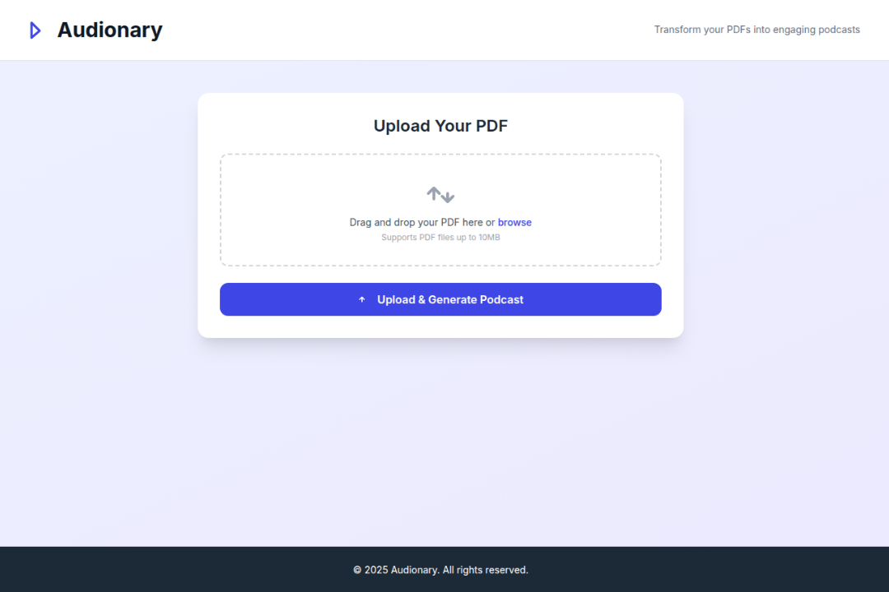
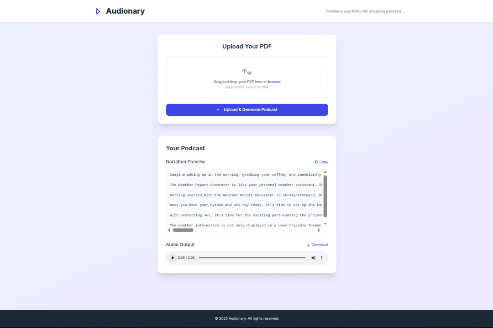

# Audionary

**Turn any PDF into an easy-to-understand audio narration.**  
Upload a file, get a smart summary, and listen to it like a podcast.

---

## Overview

Audionary transforms long and technical PDFs into digestible, spoken summaries. It's designed for anyone who wants to consume content more efficiently while commuting, multitasking, or just relaxing.

Upload a PDF → Get a natural language summary → Listen to it as audio.

---

## Features

- Upload any PDF
- Summarize complex content using AI
- Natural narration using text-to-speech
- Stream or download the audio summary
- Clean User Interface

---

## Tech Stack

| Layer           | Tools Used                               |
|-----------------|------------------------------------------|
| Backend         | Python, Django REST Framework            |
| Frontend        | HTML, Tailwind CSS, JavaScript           |
| PDF Parsing     | PyMuPDF                                  |
| AI Summarization| OpenAI + LangGraph                       |
| Text to Speech  | Google Text-to-Speech (gTTS)             |
| Storage         | Local (easily extendable to cloud)       |

---

## How It Works

1. User uploads a PDF
2. Text is extracted using PyMuPDF
3. AI summarizes the content using OpenAI and LangGraph
4. A narration is generated using gTTS
5. Audio summary is played back or available for download

---

## Project Structure

```
audionary/
├── core/                 # Django API  
│   ├── views.py  
│   ├── urls.py  
│   └── utils/            # Text extraction, summarization, audio   
├── config/               # Project Dir
├── media/                # Audio output files  
├── static/               # Static frontend assets  
├── templates/            # HTML templates  
├── .env                  # API keys and environment variables  
├── requirements.txt  
└── manage.py
```

---

## Local Setup Guide

### 1. Clone the Repository

```bash
git clone https://github.com/zohan-zafar-dev/audionary.git
cd audionary
```

### 2. Create a Virtual Environment

```bash
python -m venv venv
source venv/bin/activate   # On Windows: venv\Scripts\activate
```

### 3. Install Dependencies

```bash
pip install -r requirements.txt
```

### 4. Set Up Environment Variables

Create a `.env` file in the project root directory with the following content:

```
OPENAI_API_KEY=your_openai_api_key_here
```

### 5. Run Database Migrations

```bash
python manage.py migrate
```

### 6. Start the Development Server

```bash
python manage.py runserver
```

---

## Usage

1. Open the homepage.
2. Upload a PDF file.
3. The system will:
   - Extract the text
   - Generate a summary
   - Convert the summary to audio
4. Listen to or download the audio file.

---

## .env Example

```
OPENAI_API_KEY=your_openai_api_key_here
```

---

## UI Screenshots

  


---

## License

This project is licensed under the MIT License.
